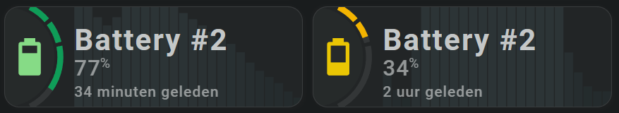

<!-- GT/GL -->
#Color Swatches and Color Palettes
:octicons-tag-24: 2.4.5 · :octicons-tools-24: Experimental

!!! Warning "Swatches do not work (yet) with the Segmented Arc tool"
    This tool fetches its colors from Lovelace to calculate intermediate colors.
    <br>Therefore, it does NOT (yet) use the colors from the loaded swatch(es)!

##:sak-sak-logo: Swatch Examples

### Rainbow Swatch
This swatch has 11 colors depicting the rainbow. It has no light or dark mode colors.

```yaml linenums="1"
#
# Color swatch with 11 rainbow colors
#
color_swatch_rainbow_11:
  template:
    type: colorswatch
  colorswatch:
    sak-cs-rainbow-01: 'white'
    sak-cs-rainbow-02: '#5e4fa2'
    sak-cs-rainbow-03: '#3288bd'
    sak-cs-rainbow-04: '#66c2a5'
    sak-cs-rainbow-05: '#abdda4'
    sak-cs-rainbow-06: '#e6f598'
    sak-cs-rainbow-07: '#fee08b'
    sak-cs-rainbow-08: '#fdae61'
    sak-cs-rainbow-09: '#f46d43'
    sak-cs-rainbow-10: '#d53e4f'
    sak-cs-rainbow-11: '#9e0142'
```
### White Orange gradient Swatch
This swatch has 10 colors showing a white orange gradient. It has no light or dark mode colors.

```yaml linenums="1"
#
# A 10 color gradient from white to orange color swatch
#
color_swatch_gradient_white_orange_10:
  template:
    type: colorswatch
  colorswatch:
    sak-cs-gradient-white-orange-01: '#FFF6E3'
    sak-cs-gradient-white-orange-02: '#FFE9B9'
    sak-cs-gradient-white-orange-03: '#FFDA8A'
    sak-cs-gradient-white-orange-04: '#FFCB5B'
    sak-cs-gradient-white-orange-05: '#FFBF37'
    sak-cs-gradient-white-orange-06: '#ffb414'
    sak-cs-gradient-white-orange-07: '#FFAD12'
    sak-cs-gradient-white-orange-08: '#FFA40E'
    sak-cs-gradient-white-orange-09: '#FF9C0B'
    sak-cs-gradient-white-orange-10: '#FF8C06'
```

### Redefining Google Brand colors
```yaml linenums="1"
#
# Google brand colors as used in the Material 3 themes
#
  brand-google-blue:    '#4285F4'
  brand-google-red:     '#DB4437'
  brand-google-yellow:  '#F4B400' 
  brand-google-green:   '#0F9D58'
```

These colors are used for example by the battery colorlist/stop.
These colors are the same in light and dark mode. This swatch changes that.

By using this color swatch, the cards/tools that use these Google Brand colors will use the colors from the color swatch.

```yaml linenums="1"
#
# Redefine Google Brand colors, and use light and dark mode colors
#
color_swatch_google_brand_colors_4:
  template:
    type: colorswatch
  colorswatch:
    modes:
      light:
        brand-google-blue:    'blue'
        brand-google-red:     'red'
        brand-google-yellow:  'yellow' 
        brand-google-green:   'green'
      dark:        
        brand-google-blue:    'lightskyblue'
        brand-google-red:     'salmon'
        brand-google-yellow:  'gold' 
        brand-google-green:   'lightgreen'
```
The following cards use the Google Brand Color for the icon:

```yaml linenums="1" hl_lines="8-13 32-37"
- type: 'custom:swiss-army-knife-card'
  entities:
    - entity: sensor.iphone_van_marco_battery_level
      name: 'Battery #2'
    - entity: sensor.iphone_van_marco_battery_level
      secondary_info: last_changed
      format: relative
  palette: 
    google_brand: 
      template:
        name: color_swatch_google_brand_colors_4
        variables:
          - dummy: 1
  layout:
    template:
      name: sak_layout_fce_sensor2
      variables:
        - sak_layout_sensor_colorstops_template: colorstops_battery_level
        - sak_layout_sensor_icon_style: colorstops
        - sak_layout_sensor_segarc_style: colorstops
        - sak_layout_sensor_scale_max: 100 

########################################################################

- type: 'custom:swiss-army-knife-card'
  entities:
    - entity: sensor.ipad_van_de_bereboot_battery_level
      name: 'Battery #2'
    - entity: sensor.ipad_van_de_bereboot_battery_level
      secondary_info: last_changed
      format: relative
  palette: 
    google_brand: 
      template:
        name: color_swatch_google_brand_colors_4
        variables:
          - dummy: 1
  layout:
    template:
      name: sak_layout_fce_sensor2
      variables:
        - sak_layout_sensor_colorstops_template: colorstops_battery_level
        - sak_layout_sensor_icon_style: colorstops
        - sak_layout_sensor_segarc_style: colorstops
        - sak_layout_sensor_scale_max: 100   
```

And with the modified Swatch colors, the colors look like this. You can see that they are different from the segmented arc colors:

{width="600"}
<br>
{width="600"}

