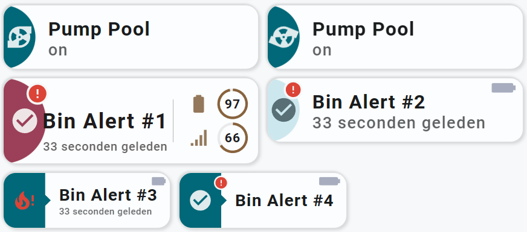
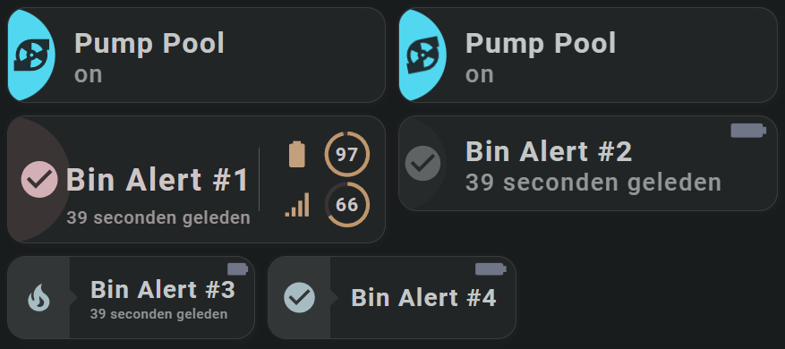

<!-- GT/GL -->
:octicons-tag-24: 2.4.5 · :octicons-tools-24: Experimental

##:sak-sak-logo: Card configuration

Using a specific Home Assistant theme for your Swiss Army Knife custom card is nothing more than specifying the name of the theme that is in the list of Home Assistant themes:

```yaml linenums="1" hl_lines="4"
  - type: 'custom:swiss-army-knife-card'
    entities:
      <list of entities>
    theme: M3-D04-Magenta
```
!!! Info "You can only select themes that are known to Home Assistant"

!!! Warning "Loading a specific theme per card does cost resources"
    Every theme needs RAM memory. If you only need a few colors, consider using a color swatch!

##:sak-sak-logo: Example views
The examples show the Magenta Material 3 theme applied to a single card between the other cards which use the Teal Blue Material 3 theme that is loaded by Home Assistant.

#### Example in light mode and alert 'off':

{width="600"}
<br>
#### Example in light mode and alert 'on':
{width="600"}

#### Example in dark mode and alert 'off':
{width="600"}
<br>
#### Example in dark mode and alert 'on':
{width="600"}
