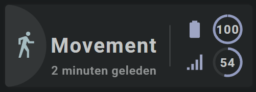

<!-- GT/GL -->

{width="300"}
{width="300"}
<br>{width="300"}
{width="300"}

This card uses the [Material 3 theme D06, TealBlue][ham3-d06-url]

| Description| Aspect Ratio| Target Size |
|-|-|-|
| A card that shows the state of a binary sensor, including an icon as an alert. <br>Nice for doors, windows and occupancy alerts.| 3/1 | Grid with 2 columns |

| SAK Tool| Used for |
|-|-|
| Circle | The half circle, as the left part of the circle is cutoff by the card. Animated, state dependent|
| Icon | Entity Icon. Animated, state dependent|
| Icon | Alert Icon. Animated, state dependent. Only visible if state is `on`|
| Name | Name of Entity|
| State | Secondary Info|
| Line | Vertical line separator |
| Icon | Battery state as icon. Animated, state dependent|
| SegArc | Simple circle as segmented arc to show the battery level|
| State | Value of battery level|
| Icon | Linkquality icon|
| SegArc | Simple circle as segmented arc to show the linkquality value|
| State | Value of linkquality|

##:sak-sak-logo: Interaction

| Part | Description|
|-|-|
| Card | All tools connected to an entity do show by default the "more-info" dialog once clicked |

##:sak-sak-logo: Usage (Not Yet Implemented)
If the below YAML example definition is encapsulated into a decluttering_template, its usage would be:

```yaml linenums="1"
- type: custom:decluttering-card
  template: sak_card_binary_sensor_alert1
  variables:
    - ...
```

In the future, SAK will support card templates, and usage would be (I hope) something like:


```yaml linenums="1"
- type: custom:swiss-army-knife-card
  template: sak_card_binary_sensor_alert1
  entities:
    - entity: binary_sensor.livingroom_movement_occupancy
      name: 'Movement'
    - entity: binary_sensor.livingroom_movement_occupancy
      secondary_info: last_changed
      format: relative
    - entity: sensor.livingroom_movement_battery
      decimals: 0
    - entity: sensor.livingroom_movement_linkquality
      decimals: 0
```

##:sak-sak-logo: YAML Example Definition

??? Info "Full definition of card"
    ```yaml linenums="1"
    - type: 'custom:swiss-army-knife-card'
      entities:
        - entity: binary_sensor.livingroom_movement_occupancy
          name: 'Movement'
        - entity: binary_sensor.livingroom_movement_occupancy
          secondary_info: last_changed
          format: relative
        - entity: sensor.livingroom_movement_battery
          decimals: 0
        - entity: sensor.livingroom_movement_linkquality
          decimals: 0
      # Define aspect ratio
      aspectratio: 3/1                          # Card is 300x100 grid

      layout:
        styles:
          card:
            # border-radius: 20px
        toolsets:
          # ================================================================
          - toolset: half-circle
            position:
              cx: 0                             # Center on cards border 
              cy: 50
            tools:
              # ------------------------------------------------------------
              - type: circle
                position:
                  cx: 50
                  cy: 50
                  radius: 50
                entity_index: 0
                animations:
                  - state: 'on'
                    styles:
                      circle:
                        fill: var(--theme-sys-color-primary)
                        # animation: flash 2s ease-in-out 5
                  - state: 'off'
                    styles:
                      circle:
                        fill: var(--theme-sys-elevation-surface-neutral4)
                styles:
                  circle:
                    stroke: none
                    # transition: fill 1s ease

          # ================================================================
          - toolset: column-icon
            position:
              cx: 25
              cy: 50
            tools:
              # ------------------------------------------------------------
              - type: icon
                position:
                  cx: 50
                  cy: 50
                  align: center
                  icon_size: 35
                entity_index: 0
                animations:
                  - state: 'on'
                    styles:
                      icon:
                        # animation: spin 3s linear infinite
                        fill: var(--primary-background-color)
                  - state: 'off'
                    styles:
                      icon:
                        fill: var(--theme-sys-color-secondary)
                        opacity: 0.9
                styles:
                  icon:
                    fill: var(--primary-background-color)
                    opacity: 0.9
                    # transition: fill 1s ease

          # ================================================================
          - toolset: alert-icon
            position:
              cx: 40
              cy: 18
            tools:
              # ------------------------------------------------------------
              - type: circle
                position:
                  cx: 50
                  cy: 50
                  radius: 13
                entity_index: 0                 # Use state from 0
                animations:
                  - state: 'on'                 # If ON
                    styles:
                      circle:
                        fill: var(--primary-background-color)
                  - state: 'off'                # If OFF
                    styles:
                      circle:
                        display: none           # Hide icon

              # ------------------------------------------------------------
              - type: icon
                position:
                  cx: 50
                  cy: 50
                  align: center
                  icon_size: 25
                entity_index: 0                 # Use state from 0
                icon: mdi:alert-circle          # Use alert circle icon
                animations:
                  - state: 'on'                 # If ON
                    styles:
                      icon:
                        fill: var(--brand-google-red, red) # Set icon to red color
                  - state: 'off'                # If OFF
                    styles:
                      icon:
                        display: none           # Hide icon
                styles:
                  icon:
                    fill: grey                  # Default grey color
                
          # ================================================================
          - toolset: column-name
            position:
              cx: 120
              cy: 50
            tools:
              # ------------------------------------------------------------
              - type: name
                position:
                  cx: 50
                  cy: 50
                entity_index: 0
                styles:
                  name:
                    text-anchor: middle
                    font-size: 25em
                    font-weight: 700
                    opacity: 1
              # ------------------------------------------------------------
              - type: state
                position:
                  cx: 50
                  cy: 80
                entity_index: 1
                show:
                  uom: none
                styles:
                  state:
                    text-anchor: middle
                    font-size: 14em
                    font-weight: 500
                    opacity: 0.7

          # ================================================================
          - toolset: line1
            position:
              cx: 200                           # On 1/3 of card width
              cy: 50
            tools:
              # ------------------------------------------------------------
              - type: line
                position:
                  cx: 50
                  cy: 50
                  orientation: vertical
                  length: 50
                styles:
                  line:
                    fill: var(--primary-text-color)
                    opacity: 0.5

          # ================================================================
          - toolset: column-battery
            position:
              cx: 250
              cy: 50
            tools:
              # ------------------------------------------------------------
              - type: icon
                position:
                  cx: 30
                  cy: 30
                  align: right
                  icon_size: 25
                entity_index: 2
                styles:
                  icon:
                    fill: var(--theme-sys-color-tertiary)
                    opacity: 0.8
              # ------------------------------------------------------------
              - type: state
                position:
                  cx: 70
                  cy: 30
                entity_index: 2
                show:
                  uom: none
                styles:
                  state:
                    text-anchor: middle
                    font-size: 15em
                    font-weight: 700
                    fill: var(--primary-text-color)
                  uom:
                    fill: var(--primary-text-color)
                    font-weight: 700

              # ------------------------------------------------------------ 
              - type: 'segarc'
                id: 0
                position:
                  cx: 70
                  cy: 30
                  start_angle: 0
                  end_angle: 360
                  width: 3
                  radius: 18
                entity_index: 2
                scale:
                  min: 0
                  max: 100
                  width: 6
                  offset: 12
                show:
                  scale: false
                  style: 'colorlist'
                segments:
                  colorlist:
                    gap: 1
                    colors:
                      - var(--theme-sys-palette-tertiary45)
                styles:
                  foreground:
                    fill: darkgrey
                  background:
                    fill: var(--theme-sys-elevation-surface-neutral4)
                    opacity: 1

          # ================================================================
          - toolset: column-linkquality
            position:
              cx: 250
              cy: 50
            tools:
              # ------------------------------------------------------------
              - type: icon
                position:
                  cx: 30
                  cy: 70
                  align: right
                  icon_size: 25
                entity_index: 3
                styles:
                  icon:
                    fill: var(--theme-sys-color-tertiary)
                    opacity: 0.8

              # ------------------------------------------------------------
              - type: state
                position:
                  cx: 70
                  cy: 70
                entity_index: 3
                show:
                  uom: none
                styles:
                  state:
                    text-anchor: middle
                    font-size: 15em
                    font-weight: 700
                    fill: var(--primary-text-color)
                  uom:
                    fill: var(--primary-text-color)
                    font-weight: 700

              # ------------------------------------------------------------ 
              - type: 'segarc'
                id: 0
                position:
                  cx: 70
                  cy: 70
                  start_angle: 0
                  end_angle: 360
                  width: 3
                  radius: 18
                entity_index: 3
                scale:
                  min: 0
                  max: 100
                  width: 6
                  offset: 12
                show:
                  scale: false
                  style: 'colorlist'
                segments:
                  colorlist:
                    gap: 1
                    colors:
                      - var(--theme-sys-palette-tertiary45)
                styles:
                  foreground:
                    fill: darkgrey
                  background:
                    fill: var(--theme-sys-elevation-surface-neutral4)
                    opacity: 1

    ```

<!-- Image references -->

<!--- Internal References... --->
[Swiss Army Knife Tutorial 02]: ../tutorials/10-step-tutorial-02-intro.md

<!--- External References... --->
[ham3-d06-url]: https://material3-themes-manual.amoebelabs.com/examples/material3-example-theme-d06-tealblue/
