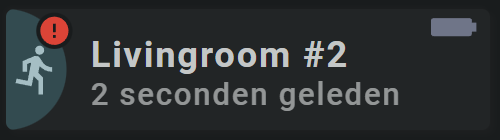

<!-- GT/GL -->

{width="300"}
{width="300"}
<br>{width="300"}
{width="300"}

This card uses the [Material 3 theme D06, TealBlue][ham3-d06-url]

| Description| Aspect Ratio| Target Size |
|-|-|-|
| A card that shows the state of a binary sensor, including an icon as an alert. <br>Nice for doors, windows and occupancy alerts.| 4/1 | Grid with 2 columns |

| SAK Tool| Used for |
|-|-|
| Circle | The half circle, as the left part of the circle is cutoff by the card. Animated, state dependent|
| Icon | Entity Icon. Animated, state dependent|
| Icon | Alert Icon. Animated, state dependent. Only visible if state is `on`|
| Name | Name of Entity|
| State | Secondary Info|
| Icon | Stretched battery Icon in the upper left corner of the card. Animated, state dependent. Becomes yellow or blinking red if battery almost dead|

##:sak-sak-logo: Interaction

| Part | Description|
|-|-|
| Card | All tools connected to an entity do show by default the "more-info" dialog once clicked |

##:sak-sak-logo: Usage
[:octicons-tag-24: 1.0.0-rc.3][github-releases]

!!! warning "Replace example entities with your entities!"

```yaml linenums="1"
- type: 'custom:swiss-army-knife-card'
  entities:
    - entity: binary_sensor.livingroom_movement_occupancy
      name: 'Bin Alert #2'
      # name: 'Livingroom #2'
    - entity: binary_sensor.livingroom_movement_occupancy
      secondary_info: last_changed
      format: relative
    - entity: sensor.livingroom_movement_battery
      decimals: 0
  layout:
    template:
      name: sak_layout_fce_binary_alert2
```

| Data | Default| Required | Description |
|-|-|-|-|
| entities |  | :material-check: | The three required entities |

##:sak-sak-logo: YAML Template Definition
[:octicons-tag-24: 1.0.0-rc.3][github-releases]
??? Info "Full definition of layout template"  
    ```yaml linenums="1"
    sak_layout_fce_binary_alert2:
      template:
        type: layout
        defaults: 
          - dummy: 0
      layout:
        aspectratio: 4/1
        toolsets:
          # ================================================================
          - toolset: half-circle
            position:
              cx: 0                             # Center on cards border 
              cy: 50
            tools:
              # ------------------------------------------------------------
              - type: circle
                position:
                  cx: 50
                  cy: 50
                  radius: 50
                entity_index: 0
                animations:
                  - state: 'on'
                    styles:
                      circle:
                        fill: var(--theme-sys-color-secondary-container)
                  - state: 'off'
                    styles:
                      circle:
                        fill: var(--theme-sys-elevation-surface-neutral2)
                styles:
                  circle:
                    stroke: none
          # ================================================================
          - toolset: column-icon
            position:
              cx: 25
              cy: 50
            tools:
              # ------------------------------------------------------------
              - type: icon
                position:
                  cx: 50
                  cy: 50
                  align: center
                  icon_size: 45
                entity_index: 0
                animations:
                  - state: 'on'
                    styles:
                      icon:
                        fill: var(--theme-sys-color-secondary)
                  - state: 'off'
                    styles:
                      icon:
                        fill: var(--theme-sys-elevation-surface-neutral10)
                styles:
                  icon:
                    opacity: 0.9
                
          # ================================================================
          - toolset: alert-icon
            position:
              cx: 40
              cy: 18
            tools:
              # ------------------------------------------------------------
              - type: circle
                position:
                  cx: 50
                  cy: 50
                  radius: 15
                entity_index: 0                 # Use state from 0
                animations:
                  - state: 'on'                 # If ON
                    styles:
                      circle:
                        fill: var(--primary-background-color)
                  - state: 'off'                # If OFF
                    styles:
                      circle:
                        display: none           # Hide icon

              # ------------------------------------------------------------
              - type: icon
                position:
                  cx: 50
                  cy: 50
                  align: center
                  icon_size: 28
                entity_index: 0                 # Use state from 0
                icon: mdi:alert-circle          # Use alert circle icon
                animations:
                  - state: 'on'                 # If ON
                    styles:
                      icon:
                        fill: var(--brand-google-red, red) # Set icon to red color
                  - state: 'off'                # If OFF
                    styles:
                      icon:
                        display: none           # Hide icon
                styles:
                  icon:
                    fill: grey                  # Default grey color

          # ================================================================
          - toolset: column-name
            position:
              cx: 70                # Left part = 75, so 75+(300-75)/2
              cy: 50
            tools:
              # ------------------------------------------------------------
              - type: name
                position:
                  cx: 50
                  cy: 37
                entity_index: 0
                styles:
                  name:
                    text-anchor: start
                    font-size: 30em
                    font-weight: 700
                    opacity: 1
              # ------------------------------------------------------------
              - type: state
                position:
                  cx: 50
                  cy: 70
                entity_index: 1
                show:
                  uom: none
                styles:
                  state:
                    text-anchor: start
                    font-size: 26em
                    font-weight: 500
                    opacity: 0.7

          # ================================================================
          - toolset: battery-icon
            position:
              cx: 370
              cy: 15
              scale_y: 1.5                      # Make battery taller
              rotate: 90
            tools:
              # ------------------------------------------------------------
              - type: icon
                position:
                  cx: 50
                  cy: 50
                  align: end
                  icon_size: 30
                entity_index: 2
                animations:
                  - state: '20'             # Battery almost dead!
                    operator: <=
                    styles:
                      icon:
                        animation: blinkingText 2s ease-in-out both infinite
                        fill: var(--brand-google-red)
                  - state: '30'             # Battery warning!
                    operator: <=
                    styles:
                      icon:
                        fill: var(--brand-google-yellow)
                styles:
                  icon:
                    fill: var(--theme-sys-color-tertiary)
                    opacity: 0.5
    ```
<!-- Image references -->

<!--- Internal References... --->
[Swiss Army Knife Tutorial 02]: ../tutorials/10-step-tutorial-02-intro.md

<!--- External References... --->
[ham3-d06-url]: https://material3-themes-manual.amoebelabs.com/examples/material3-example-theme-d06-tealblue/
[github-releases]: https://github.com/amoebelabs/swiss-army-knife-card/releases/
