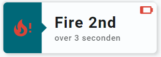

<!-- GT/GL -->

{width="200"}
{width="200"}
<br>{width="200"}
{width="200"}

This card uses the [Material 3 theme D06, TealBlue][ham3-d06-url]

| Description| Aspect Ratio| Target Size |
|-|-|-|
| A card that shows the state of a binary sensor, including an icon as an alert. <br>Nice for doors, windows and occupancy alerts.| 3/1 | Grid with 3 columns |

| SAK Tool| Used for |
|-|-|
| Badge | Background of card. Left part is animated, state dependent|
| Icon | Entity Icon. Animated, state dependent. Red if active|
| Name | Name of Entity|
| State | Secondary Info of Entity|
| Icon | Normal battery Icon in the upper left corner of the card. Animated, state dependent. Becomes yellow or blinking red if battery almost dead. Entity can be disabled |

##:sak-sak-logo: Interaction

| Part | Description|
|-|-|
| Card | All tools connected to an entity do show by default the "more-info" dialog once clicked |

##:sak-sak-logo: Usage
[:octicons-tag-24: 1.0.0-rc.3][github-releases]

!!! warning "Replace example entities with your entities!"

```yaml linenums="1"
- type: 'custom:swiss-army-knife-card'
  entities:
    - entity: binary_sensor.livingroom_movement_occupancy
      name: 'Bin Alert #3'
    - entity: binary_sensor.livingroom_movement_occupancy
      secondary_info: last_changed
      format: relative
    - entity: sensor.livingroom_movement_battery
      decimals: 0
  layout:
    template:
      name: sak_layout_fce_binary_alert3
```

| Data | Default| Required | Description |
|-|-|-|-|
| entities |  | :material-check: | The three required entities |
| sak_layout_binary_alert_battery_entity_disabled | false | :material-close: | If no battery entity available for this sensor. Disable this tool |

##:sak-sak-logo: YAML Template Definition
[:octicons-tag-24: 1.0.0-rc.3][github-releases]
??? Info "Full definition of layout template"  
    ```yaml linenums="1"
    sak_layout_fce_binary_alert3:
      template:
        type: layout
        defaults: 
          - sak_layout_binary_alert_battery_entity_disabled: false
      layout:
        aspectratio: 3/1
        toolsets:
          # ================================================================
          - toolset: badge-background
            position:
              cx: 150                           # Center at middle of card
              cy: 50                            # Center at middle of card
            tools:
              - type: badge
                position:
                  cx: 50
                  cy: 50
                  height: 100                   # Badge covers the full..
                  width: 300                    # ...size of the card
                  ratio: 25
                  radius: 5
                  divider: 20
                entity_index: 0                 # Uses entity 0
                animations:
                  - state: 'on'                 # Animate for state ON
                    styles:
                      left:
                        fill: var(--theme-sys-color-primary)
                  - state: 'off'                # Animate for state OFF
                    styles:
                      left:
                        fill: var(--theme-sys-elevation-surface-neutral4)
                styles:
                  left:
                    fill: grey
                  right:
                    fill: none                 # Show background of card

          # ================================================================
          - toolset: column-icon
            position:
              cx: 37.5
              cy: 50
            tools:
              # ------------------------------------------------------------
              - type: icon
                position:
                  cx: 50
                  cy: 50
                  align: center
                  icon_size: 45
                entity_index: 0
                animations:
                  - state: 'on'
                    icon: 'mdi:fire-alert'
                    styles:
                      icon:
                        fill: var(--brand-google-red)
                        opacity: 1
                  - state: 'off'
                    icon: 'mdi:fire'
                    styles:
                      icon:
                        fill: var(--theme-sys-color-secondary)
                        opacity: 0.9
                styles:
                  icon:
                    fill: var(--primary-background-color)
                    opacity: 0.9

          # ================================================================
          - toolset: battery-icon
            disabled: '[[sak_layout_binary_alert_battery_entity_disabled]]'
            position:
              cx: 280
              cy: 15
              rotate: 90
            tools:
              # ------------------------------------------------------------
              - type: icon
                position:
                  cx: 50
                  cy: 50
                  align: center
                  icon_size: 30
                entity_index: 2
                animations:
                  - state: '20'             # Battery almost dead!
                    operator: <=
                    styles:
                      icon:
                        animation: blinkingText 2s ease-in-out both infinite
                        fill: var(--brand-google-red)
                  - state: '30'             # Battery warning!
                    operator: <=
                    styles:
                      icon:
                        fill: var(--brand-google-yellow)
                styles:
                  icon:
                    fill: var(--theme-sys-color-tertiary)
                    opacity: 0.5
                    
          # ================================================================
          - toolset: column-name
            position:
              cx: 100               # Left part = 75, so 75+(300-75)/2
              cy: 50
            tools:
              # ------------------------------------------------------------
              - type: name
                position:
                  cx: 50
                  cy: 40
                entity_index: 0
                styles:
                  name:
                    text-anchor: start
                    font-size: 30em
                    font-weight: 700
                    opacity: 1
              # ------------------------------------------------------------
              - type: state
                position:
                  cx: 50
                  cy: 70
                entity_index: 1
                show:
                  uom: none
                styles:
                  state:
                    text-anchor: start
                    font-size: 16em
                    font-weight: 500
                    opacity: 0.7
    ```
<!-- Image references -->

<!--- Internal References... --->
[Swiss Army Knife Tutorial 02]: ../tutorials/10-step-tutorial-02-intro.md

<!--- External References... --->
[ham3-d06-url]: https://material3-themes-manual.amoebelabs.com/examples/material3-example-theme-d06-tealblue/
[github-releases]: https://github.com/amoebelabs/swiss-army-knife-card/releases/
