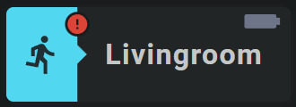

<!-- GT/GL -->

{width="200"}
{width="200"}
<br>{width="200"}
{width="200"}

This card uses the [Material 3 theme D06, TealBlue][ham3-d06-url]

| Description| Aspectratio| Target Size |
|-|-|-|
| A card that shows the state of a binary sensor, including an icon as an alert. <br>Nice for doors, windows and occupancy alerts.| 3/1 | Grid with 3 columns |

| SAK Tool| Used for |
|-|-|
| Badge | Background of card. Left part is animated, state dependent|
| Icon | Entity Icon. Animated, state dependent. Red if active|
| Icon | Alert Icon. Animated, state dependent. Only visible if state is `on`|
| Name | Name of Entity|
| Icon | Stretched battery Icon in the upper left corner of the card. Animated, state dependent. Becomes yellow or blinking red if battery almost dead|

##:sak-sak-logo: Interaction

| Part | Description|
|-|-|
| Card | All tools connected to an entity do show by default the "more-info" dialog once clicked |

##:sak-sak-logo: Usage
If the below YAML example definition is encapsulated into a decluttering_template, its usage would be:

```yaml linenums="1"
- type: custom:decluttering-card
  template: sak_card_binary_sensor_alert4
  variables:
    - ...
```

In the future, SAK will support card templates, and usage would be (I hope) something like:


```yaml linenums="1"
- type: custom:swiss-army-knife-card
  template: sak_card_binary_sensor_alert4
  entities:
    - entity: binary_sensor.livingroom_movement_occupancy
      name: 'Livingroom'
    - entity: binary_sensor.livingroom_movement_occupancy
      secondary_info: last_changed
      format: relative
    - entity: sensor.livingroom_movement_battery
      decimals: 0
```

##:sak-sak-logo: YAML Example Definition

??? Info "Full definition of card"
    ```yaml linenums="1"
        - type: 'custom:swiss-army-knife-card'
          entities:
            - entity: binary_sensor.livingroom_movement_occupancy
              name: 'Livingroom'
            - entity: binary_sensor.livingroom_movement_occupancy
              secondary_info: last_changed
              format: relative
            - entity: sensor.studym_iaq_battery
              decimals: 0
          # Define aspect ratio
          aspectratio: 3/1                          # Card is 300x100 grid

          layout:
            styles:
              card:
                # border-radius: 25em
            toolsets:
              # ================================================================
              - toolset: badge-background
                position:
                  cx: 150
                  cy: 50
                tools:
                  - type: badge
                    position:
                      cx: 50
                      cy: 50
                      height: 100
                      width: 300
                      ratio: 25
                      radius: 5
                      divider: 20
                    entity_index: 0
                    animations:
                      - state: 'on'
                        styles:
                          left:
                            fill: var(--theme-sys-color-primary)
                      - state: 'off'
                        styles:
                          left:
                            fill: var(--theme-sys-elevation-surface-neutral4)
                    styles:
                      left:
                        fill: grey
                      right:
                        fill: none
              # ================================================================
              - toolset: column-icon
                position:
                  cx: 37.5
                  cy: 50
                tools:
                  # ------------------------------------------------------------
                  - type: icon
                    position:
                      cx: 50
                      cy: 50
                      align: center
                      icon_size: 45
                    entity_index: 0
                    animations:
                      - state: 'on'
                        styles:
                          icon:
                            fill: var(--primary-background-color)
                      - state: 'off'
                        styles:
                          icon:
                            fill: var(--theme-sys-color-secondary)
                    styles:
                      icon:
                        fill: var(--primary-background-color)
                        opacity: 0.9
                    
              # ================================================================
              - toolset: alert-icon
                position:
                  cx: 75
                  cy: 18
                tools:
                  # ------------------------------------------------------------
                  - type: circle
                    position:
                      cx: 50
                      cy: 50
                      radius: 13
                    entity_index: 0                 # Use state from 0
                    animations:
                      - state: 'on'                 # If ON
                        styles:
                          circle:
                            fill: var(--primary-background-color)
                      - state: 'off'                # If OFF
                        styles:
                          circle:
                            display: none           # Hide icon

                  # ------------------------------------------------------------
                  - type: icon
                    position:
                      cx: 50
                      cy: 50
                      align: center
                      icon_size: 25
                    entity_index: 0                 # Use state from 0
                    icon: mdi:alert-circle          # Use alert circle icon
                    animations:
                      - state: 'on'                 # If ON
                        styles:
                          icon:
                            fill: var(--brand-google-red, red) # Set icon to red color
                      - state: 'off'                # If OFF
                        styles:
                          icon:
                            display: none           # Hide icon
                    styles:
                      icon:
                        fill: grey                  # Default grey color

              # ================================================================
              - toolset: column-name
                position:
                  cx: 100
                  cy: 50
                tools:
                  # ------------------------------------------------------------
                  - type: name
                    position:
                      cx: 50
                      cy: 50
                    entity_index: 0
                    styles:
                      name:
                        text-anchor: start
                        font-size: 30em
                        font-weight: 700
                        opacity: 1

              # ================================================================
              - toolset: battery-icon
                position:
                  cx: 270
                  cy: 15
                  scale_y: 1.5                      # Make battery taller
                  rotate: 90
                tools:
                  # ------------------------------------------------------------
                  - type: icon
                    position:
                      cx: 50
                      cy: 50
                      align: center
                      icon_size: 30
                    entity_index: 2
                    animations:
                      - state: '20'             # Battery almost dead!
                        operator: <=
                        styles:
                          icon:
                            animation: blinkingText 2s ease-in-out both infinite
                            fill: var(--brand-google-red)
                      - state: '30'             # Battery warning!
                        operator: <=
                        styles:
                          icon:
                            fill: var(--brand-google-yellow)
                    styles:
                      icon:
                        fill: var(--theme-sys-color-tertiary)
                        opacity: 0.5
    ```
<!-- Image references -->

<!--- Internal References... --->
[Swiss Army Knife Tutorial 02]: ../tutorials/10-step-tutorial-02-intro.md

<!--- External References... --->
[ham3-d06-url]: https://material3-themes-manual.amoebelabs.com/examples/material3-example-theme-d06-tealblue/
