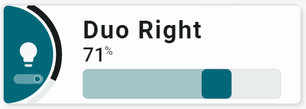

<!-- GT/GL -->

{width="300"}
{width="300"}
<br>{width="300"}
{width="300"}

This card uses the [Material 3 theme D06, TealBlue][ham3-d06-url]

| Description| Aspect Ratio| Target Size |
|-|-|-|
| A card that can control a light and includes a slider for brightness percentage| 3/1 | Grid with 2 columns |

| SAK Tool| Used for |
|-|-|
| Circle | The half circle, as the left part of the circle is cutoff by the card. Animated, state dependent|
| Icon | Entity Icon. Animated, state dependent|
| Switch | The Switch to toggle the light|
| Name | Name of Entity|
| State | Brightness Attribute (from slider)|
| Slider | Slider to control the brightness of the light|

##:sak-sak-logo: Interaction

| Part | Description|
|-|-|
| Left part | Toggles the light once tapped|
| Slider | Sets the brightness of the light|
| Other parts | All tools connected to an entity do show by default the "more-info" dialog once clicked |

##:sak-sak-logo: Usage
[:octicons-tag-24: 1.0.0-rc.3][github-releases]

!!! warning "Replace example entities with your entities!"

```yaml linenums="1"
- type: 'custom:swiss-army-knife-card'
  entities:
    - entity: light.livingroom_light_duo_right_light
      name: 'Light /w Slider'
    - entity: light.livingroom_light_duo_right_light
      attribute: brightness
      unit_of_measurement: "%"
    - entity: light.livingroom_light_duo_right_light
      secondary_info: last_changed
      format: relative
  layout:
    template:
      name: sak_layout_fce_light_with_slider
```

| Data | Default| Required | Description |
|-|-|-|-|
| entities |  | :material-check: | The single entity on the card |
| sak_layout_light_toggle_service | true | :material-close: | The actual service to call to toggle the light. If you have a switch to control the light, the `light.toggle` service won't work and you have to replace this with `switch.toggle` |

##:sak-sak-logo: YAML Template Definition
[:octicons-tag-24: 1.0.0-rc.3][github-releases]
??? Info "Full definition of layout template"
    ```yaml linenums="1"
    sak_layout_fce_light_with_slider:
      template:
        type: layout
        defaults: 
          - sak_layout_light_toggle_service: light.toggle
      layout:
        aspectratio: 3/1
        toolsets:
          # ================================================================
          - toolset: column-icon
            position:
              cx: 0
              cy: 50
            tools:
              # ------------------------------------------------------------
              - type: circle
                position:
                  cx: 50
                  cy: 50
                  radius: 50
                entity_index: 0
                animations:
                  - state: 'on'
                    styles:
                      circle:
                        fill: var(--theme-sys-color-primary)
                        # animation: flash 2s ease-in-out 5
                  - state: 'off'
                    styles:
                      circle:
                        fill: var(--theme-sys-color-secondary-container)
                # Remove user actions part to just display the state
                # or disable pointer-events via a class or style
                # Using a class enables the use of variables that can
                # disable pointer-events to none!
                user_actions:
                  tap_action:
                    haptic: light
                    actions:
                      - action: call-service
                        service: light.toggle
                styles:
                  circle:
                    fill: var(--theme-sys-color-secondary-container)
                    stroke: var(--theme-sys-color-secondary)
                    stroke-width: 0em

              # ------------------------------------------------------------ 
              - type: 'segarc'
                id: 0
                position:
                  cx: 50
                  cy: 50
                  start_angle: 25
                  end_angle: 155
                  width: 6
                  radius: 59
                entity_index: 1
                scale:
                  min: 0
                  max: 100
                  width: 6
                  offset: 12
                show:
                  scale: false
                  style: 'colorlist'
                derived_entity:
                  input : '[[[ return state ]]]'
                  state: >
                    [[[
                      if (typeof(entity) === 'undefined') return;
                      if (typeof(state) === 'undefined') return;
                      
                      var bri = Math.round(state / 2.55);
                      return (bri ? bri : '0');
                    ]]]
                  unit: >
                    [[[
                      if (typeof(state) === 'undefined') return undefined;
                      return '%';
                    ]]]
                segments:
                  colorlist:
                    gap: 1
                    colors:
                      - 'var(--primary-text-color)'
                animation:
                  duration: 5
                styles:
                  foreground:
                    fill: darkgrey
                  background:
                    fill: var(--theme-sys-elevation-surface-neutral4)
                    

              # ------------------------------------------------------------
              - type: icon
                position:
                  cx: 75
                  cy: 50
                  align: center
                  icon_size: 30
                entity_index: 0
                animations:
                  - state: 'on'
                    styles:
                      icon:
                        # animation: spin 3s linear infinite
                        fill: var(--primary-background-color)
                  - state: 'off'
                    styles:
                      icon:
                        # fill: var(--theme-sys-color-on-secondary-container)
                        fill: var(--theme-sys-color-secondary)
                styles:
                  icon:
                    fill: var(--theme-sys-color-secondary)
                    # opacity: 0.7
                    pointer-events: none

          # ================================================================
          - toolset: switch
            position:
              cx: 25                           # On 1/3 of card width
              cy: 75
              scale: 1.8
            tools:
              # ------------------------------------------------------------
              - type: switch
                position:
                  cx: 50
                  cy: 50
                  orientation: 'horizontal'
                  track:
                    width: 15
                    height: 5
                    radius: 2.5
                  thumb:
                    width: 3
                    height: 3
                    radius: 2.5
                    offset: 4.5
                entity_index: 0
                user_actions:
                  tap_action:
                    haptic: light
                    actions:
                      - action: call-service
                        service: '[[sak_layout_light_toggle_service]]'
                styles:
                  track:
                    --switch-checked-track-color: var(--primary-background-color)
                    --switch-unchecked-track-color: var(--theme-sys-color-secondary)
                    # --switch-checked-button-color: 
                  thumb:
                    --thumb-stroke: 'var(--primary-background-color)'
                    
          # ================================================================
          - toolset: column-name
            position:
              cx: 80
              cy: 25
            tools:
              # ------------------------------------------------------------
              - type: name
                position:
                  cx: 50
                  cy: 50
                entity_index: 0
                styles:
                  name:
                    text-anchor: start
                    font-size: 25em
                    font-weight: 700
                    opacity: 1

          # ================================================================
          - toolset: slider
            position:
              cx: 180
              cy: 80
            tools:
              # ------------------------------------------------------------
              - type: slider
                position:
                  cx: 50
                  cy: 50
                  orientation: horizontal
                  capture:
                    width: 200
                    height: 35
                  active:
                    # width: 200
                    height: 30
                    radius: 5
                  track:
                    width: 200
                    height: 30
                    radius: 5
                  thumb:
                    width: 30
                    height: 30
                    radius: 5
                  label:
                    # placement can be none, thumb, position (cx,cy)
                    placement: position
                    cx: -50
                    cy: 20
                entity_index: 1
                # Does this work??
                animations:
                  # - state: >
                      # [[[
                        # if (typeof(state) === 'undefined') return state;
                        # return 'no-match';
                      # ]]]
                  - state: 'undefined'
                    operator: '=='
                    styles:
                      thumb:
                        # animation: spin 3s linear infinite
                        # fill: var(--primary-background-color)
                        fill: var(--theme-sys-color-secondary-container)
                  # - state: '50'
                    # operator: '<='
                    # styles:
                      # track:
                        # # fill: var(--theme-sys-color-on-secondary-container)
                        # fill: var(--theme-sys-color-secondary)
                  - state: 'undefined'
                    operator: '!='
                    styles:
                      track:
                        dummy: 1
                derived_entity:
                  input : '[[[ return state ]]]'
                  state: >
                    [[[
                      if (typeof(entity) === 'undefined') return;
                      if (typeof(state) === 'undefined') return;
                      
                      var bri = Math.round(state / 2.55);
                      return (bri ? bri : '0');
                    ]]]
                  unit: >
                    [[[
                      if (typeof(state) === 'undefined') return undefined;
                      return '%';
                    ]]]
                show:
                  # uom: none
                  active: true
                user_actions:
                  drag_action:
                    update_interval: 200          # Update every 200msec
                    haptic: selection
                    actions:
                      - action: call-service
                        service: light.turn_on
                        parameter: brightness_pct
                  tap_action:
                    haptic: light
                    actions:
                      - action: call-service
                        service: light.turn_on
                        parameter: brightness_pct
                scale:
                  min: 1
                  max: 100
                  step: 1
                styles:
                  label:
                    text-anchor: start
                    font-size: 20em
                    font-weight: 500
                    pointer-events: auto
                  uom:
                    font-weight: 600
                  capture:
                    pointer-events: all
                    touch-action: none
                  active:
                    # fill: url(#sak-light-brightness-gradient--orange) #white
                    fill: var(--theme-sys-elevation-surface-neutral10)
                    fill: var(--theme-sys-color-secondary)
                    fill: var(--theme-sys-color-primary)
                    fill-opacity: 0.3
                    pointer-events: none
                  track:
                    # fill: url(#sak-light-brightness-gradient)
                    fill: var(--theme-sys-elevation-surface-neutral4)
                    fill-opacity: 1
                    stroke-width: 0.2em
                    stroke: var(--theme-sys-elevation-surface-neutral10)
                    pointer-events: none
                  thumb:
                    # stroke-width: 1.2em
                    # stroke: var(--primary-background-color)
                    # stroke-opacity: 1
                    # fill: var(--primary-text-color)
                    fill: var(--theme-sys-color-primary)
                    fill-opacity: 1
                    pointer-events: none
                    transition: all .5s ease
    ```
<!-- Image references -->

<!--- Internal References... --->
[Swiss Army Knife Tutorial 02]: ../tutorials/10-step-tutorial-02-intro.md

<!--- External References... --->
[ham3-d06-url]: https://material3-themes-manual.amoebelabs.com/examples/material3-example-theme-d06-tealblue/
[github-releases]: https://github.com/amoebelabs/swiss-army-knife-card/releases/
