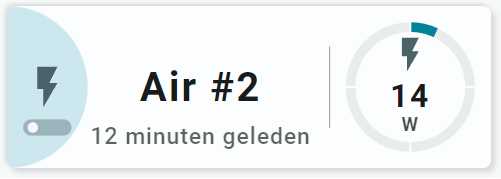
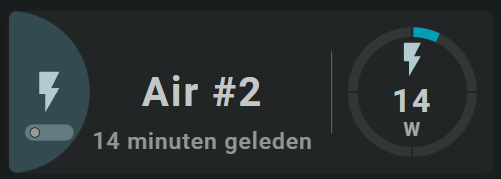

<!-- GT/GL -->
##:sak-sak-logo: Visualization

{width="300"}
{width="300"}
<br>{width="300"}
{width="300"}

This card uses the [Material 3 theme D06, TealBlue][ham3-d06-url]

| Description| Aspect Ratio| Target Size |
|-|-|-|
| A card that controls the on/off state of a power outlet, but also displays the power value. <br>Both using a segmented arc and as state.| 3/1 | Grid with 2 columns |

| SAK Tool| Used for |
|-|-|
| Circle | The half circle, as the left part of the circle is cutoff by the card. Animated, state dependent|
| Icon | Entity Icon. Animated, state dependent|
| Switch | Switch to indicate and control the state. Animated, state dependent|
| Name | Name of Entity|
| State | Secondary Info of entity|
| Line | Vertical line separator|
| SegArc | Segmented arc showing the sensors state with a single color|
| Icon | Entity Icon|
| State | Entity State|

##:sak-sak-logo: Interaction

| Part | Description|
|-|-|
| Card | All tools connected to an entity do show by default the "more-info" dialog once clicked |

##:sak-sak-logo: Usage (Not Yet Implemented)
If the below YAML example definition is encapsulated into a decluttering_template, its usage would be:

```yaml linenums="1"
- type: custom:decluttering-card
  template: sak_card_power_outlet2
  variables:

```

In the future, SAK will support card templates, and usage would be (I hope) something like:


```yaml linenums="1"
- type: custom:swiss-army-knife-card
  template: sak_card_power_outlet2
  entities:
    - entity: sensor.kitchen_group_energy_power
      name: 'Air #2'
    - entity: sensor.kitchen_group_energy_power
      secondary_info: last_changed
      format: relative
    - entity: switch.washingmachine_energy
      name: 'Air #2'
```

##:sak-sak-logo: YAML Example Definition

??? Info "Full definition of card"
    ```yaml
        - type: 'custom:swiss-army-knife-card'
          entities:
            - entity: sensor.kitchen_group_energy_power
              name: 'Air #2'
            - entity: sensor.kitchen_group_energy_power
              secondary_info: last_changed
              format: relative
            - entity: switch.washingmachine_energy
              name: 'Air #2'
          # Define aspect ratio
          aspectratio: 3/1                          # Card is 300x100 grid

          layout:
            toolsets:
              # ================================================================
              - toolset: column-icon
                position:
                  cx: 0
                  cy: 50
                tools:
                  # ------------------------------------------------------------
                  - type: circle
                    position:
                      cx: 50
                      cy: 50
                      radius: 50
                    entity_index: 2
                    animations:
                      - state: 'on'
                        styles:
                          circle:
                            fill: var(--theme-sys-color-primary)
                            # animation: flash 2s ease-in-out 5
                      - state: 'off'
                        styles:
                          circle:
                            fill: var(--theme-sys-color-secondary-container)
                    # Remove user actions part to just display the state
                    # or disable pointer-events via a class or style
                    # Using a class enables the use of variables that can
                    # disable pointer-events to none!
                    user_actions:
                      tap_action:
                        haptic: light
                        actions:
                          - action: call-service
                            service: switch.toggle
                    styles:
                      circle:
                        fill: var(--theme-sys-color-secondary-container)
                        stroke: var(--theme-sys-color-secondary)
                        stroke-width: 0em

                  # ------------------------------------------------------------
                  - type: icon
                    position:
                      cx: 75
                      cy: 50
                      align: center
                      icon_size: 30
                    entity_index: 2
                    animations:
                      - state: 'on'
                        styles:
                          icon:
                            # animation: spin 3s linear infinite
                            fill: var(--primary-background-color)
                      - state: 'off'
                        styles:
                          icon:
                            # fill: var(--theme-sys-color-on-secondary-container)
                            fill: var(--theme-sys-color-secondary)
                    styles:
                      icon:
                        fill: var(--theme-sys-color-secondary)
                        # opacity: 0.7
                        pointer-events: none

              # ================================================================
              - toolset: switch
                position:
                  cx: 25                           # On 1/3 of card width
                  cy: 75
                  scale: 2
                tools:
                  # ------------------------------------------------------------
                  - type: switch
                    position:
                      cx: 50
                      cy: 50
                      orientation: 'horizontal'
                      track:
                        width: 15
                        height: 5
                        radius: 2.5
                      thumb:
                        width: 3
                        height: 3
                        radius: 2.5
                        offset: 4.5
                    entity_index: 2
                    user_actions:
                      tap_action:
                        haptic: light
                        actions:
                          - action: call-service
                            service: switch.toggle
                    styles:
                      track:
                        --switch-checked-track-color: var(--primary-background-color)
                        --switch-unchecked-track-color: var(--theme-sys-color-secondary)
                        # --switch-checked-button-color: 
                      thumb:
                        --thumb-stroke: 'var(--primary-background-color)'
                        
              # ================================================================
              - toolset: column-name
                position:
                  cx: 120
                  cy: 50
                tools:
                  # ------------------------------------------------------------
                  - type: name
                    position:
                      cx: 50
                      cy: 50
                    entity_index: 0
                    styles:
                      name:
                        text-anchor: middle
                        font-size: 25em
                        font-weight: 700
                        opacity: 1
                  # ------------------------------------------------------------
                  - type: state
                    position:
                      cx: 50
                      cy: 80
                    entity_index: 1
                    show:
                      uom: none
                    styles:
                      state:
                        text-anchor: middle
                        font-size: 14em
                        font-weight: 500
                        opacity: 0.7

              # ================================================================
              - toolset: line1
                position:
                  cx: 200                           # On 1/3 of card width
                  cy: 50
                tools:
                  # ------------------------------------------------------------
                  - type: line
                    position:
                      cx: 50
                      cy: 50
                      orientation: vertical
                      length: 50
                    styles:
                      line:
                        fill: var(--primary-text-color)
                        opacity: 0.5

              # ================================================================
              - toolset: column-load
                template:
                  name: toolset_tutorial_02_part1
                  variables:
                    - var_entity_index: 0
                    - var_toolset_position_cx: 250
                    - var_segarc_scale_max: 200
    ```

<!-- Image references -->

<!--- Internal References... --->
[Swiss Army Knife Tutorial 02]: ../tutorials/10-step-tutorial-02-intro.md

<!--- External References... --->
[ham3-d06-url]: https://material3-themes-manual.amoebelabs.com/examples/material3-example-theme-d06-tealblue/


