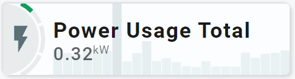
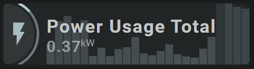

<!-- GT/GL -->
##:sak-sak-logo: Visualization

{width="300"}
{width="300"}
<br>{width="300"}

This card uses the [Material 3 theme D06, TealBlue][ham3-d06-url]

| Description| Aspectratio| Target Size |
|-|-|-|
| A card that displays a sensor value. Both using a segmented arc and as state.<br>The 24 hour history is shown in the background| 4/1 | Grid with 2 columns |

| SAK Tool| Used for |
|-|-|
| Circle | The half circle, as the left part of the circle is cutoff by the card.|
| Icon | Entity Icon.
| SegArc | Minimalistic implementation of segmented arc showing the sensors state with 3 Google colors (green, yellow, red) |
| Name | Name of Entity|
| State | Value of entity|
| Bar | Shows the 24 hour history in the background|

##:sak-sak-logo: Interaction

| Part | Description|
|-|-|
| Card | All tools connected to an entity do show by default the "more-info" dialog once clicked |

##:sak-sak-logo: Usage (Not Yet Implemented)
If the below YAML example definition is encapsulated into a decluttering_template, its usage would be:

```yaml linenums="1"
- type: custom:decluttering-card
  template: sak_card_sensor2
  variables:
    - entity: sensor.dsmr_reading_electricity_currently_delivered
    - entity_name: 'Power Usage Total'
```

In the future, SAK will support card templates, and usage would be (I hope) something like:


```yaml linenums="1"
- type: custom:swiss-army-knife-card
  template: sak_card_sensor2
  entities:
    - entity: sensor.dsmr_reading_electricity_currently_delivered
      name: 'Power Usage Total'
```

##:sak-sak-logo: YAML Example Definition

??? Info "Full definition of card"
    ```yaml linenums="1"
        - type: 'custom:swiss-army-knife-card'
          entities:
            - entity: sensor.dsmr_reading_electricity_currently_delivered
              name: 'Power Usage Total'
          # Define aspect ratio
          aspectratio: 4/1                          # Card is 400x100 grid

          layout:
            styles:
              card:
            toolsets:
              # ================================================================
              - toolset: half-circle
                position:
                  cx: 0                             # Center on cards border 
                  cy: 50
                tools:
                  # ------------------------------------------------------------
                  - type: circle
                    position:
                      cx: 50
                      cy: 50
                      radius: 50
                    styles:
                      circle:
                        stroke: none
                        fill: var(--theme-sys-elevation-surface-neutral4)

                  # ------------------------------------------------------------ 
                  - type: 'segarc'
                    id: 0
                    position:
                      cx: 50
                      cy: 50
                      start_angle: 25
                      end_angle: 155
                      width: 6
                      radius: 59
                    entity_index: 0
                    scale:
                      min: 0
                      max: 2
                      width: 6
                      offset: 12
                    show:
                      scale: false
                      style: 'colorlist'
                    segments:
                      colorlist:
                        gap: 2
                        colors:
                          - var(--brand-google-green)
                          - var(--brand-google-yellow)
                          - var(--brand-google-red)
                    styles:
                      foreground:
                        fill: darkgrey
                      background:
                        fill: var(--theme-sys-elevation-surface-neutral4)

              # ================================================================
              - toolset: column-icon
                position:
                  cx: 25
                  cy: 50
                tools:
                  # ------------------------------------------------------------
                  - type: icon
                    position:
                      cx: 50
                      cy: 50
                      align: center
                      icon_size: 45
                    entity_index: 0
                    styles:
                      icon:
                        fill: var(--theme-sys-color-secondary)
                        opacity: 0.9
                    

              # ================================================================
              - toolset: column-bar
                position:
                  cx: 235                     # 400-70/2 + 70=235
                  cy: 50
                tools:
                  # ------------------------------------------------------------
                  - type: bar
                    id: 1
                    entity_index: 0
                    position:
                      orientation: vertical
                      cx: 50
                      cy: 50
                      width: 330              # 400-70=330
                      height: 100
                      margin: 1
                    hours: 24
                    barhours: 1
                    show:
                      style: 'minmaxgradient'
                    minmaxgradient:
                      fill: true
                      colors:
                        min: var(--theme-sys-palette-secondary85)
                        max: var(--theme-sys-palette-secondary65)
                    styles:
                      bar:
                        stroke-linecap: square
                        opacity: 0.25

              # ================================================================
              - toolset: column-name
                position:
                  cx: 70                # Left part = 75, so 75+(300-75)/2
                  cy: 50
                tools:
                  # ------------------------------------------------------------
                  - type: name
                    position:
                      cx: 50
                      cy: 37
                    entity_index: 0
                    styles:
                      name:
                        text-anchor: start
                        font-size: 30em
                        font-weight: 700
                  # ------------------------------------------------------------
                  - type: state
                    position:
                      cx: 50
                      cy: 70
                    entity_index: 0
                    styles:
                      state:
                        text-anchor: start
                        font-size: 26em
                        font-weight: 500
                        opacity: 0.7
    ```

<!-- Image references -->

<!--- Internal References... --->
[Swiss Army Knife Tutorial 02]: ../tutorials/10-step-tutorial-02-intro.md

<!--- External References... --->
[ham3-d06-url]: https://material3-themes-manual.amoebelabs.com/examples/material3-example-theme-d06-tealblue/
