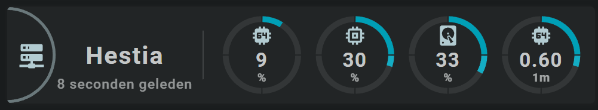

<!-- GT/GL -->
##:sak-sak-logo: Visualization

{width="600"}
<br>{width="600"}

This card uses the [Material 3 theme D06, TealBlue][ham3-d06-url]

| Description| Aspectratio| Target Size |
|-|-|-|
| A card that displays the main server statistics. <br>CPU load, memory used, disk used and the 1 minute system load | 6/1 | Grid with 1 column |

| SAK Tool| Used for |
|-|-|
| Circle | The half circle, as the left part of the circle is cutoff by the card. Circle is animated, state dependent|
| Icon | Entity Icon.
| Name | Name of Entity|
| State | Secondary Info of Entity|
| Template x4| Uses the `toolset_tutorial_02_part1` template created in the [Swiss Army Knife Tutorial 02][Swiss Army Knife Tutorial 02].<br>This template shows the segmented arc with icon and state display for cpu, memory, disk and 1minute system load |

##:sak-sak-logo: Interaction

| Part | Description|
|-|-|
| Card | All tools connected to an entity do show by default the "more-info" dialog once clicked |

##:sak-sak-logo: Usage (Not Yet Implemented)
If the below YAML example definition is encapsulated into a decluttering_template, its usage would be:

```yaml linenums="1"
- type: custom:decluttering-card
  template: sak_card_server_statistics
  variables:
    - entity_cpu: sensor.processor_use
    - entity_cpu_decimals: 0
    - entity_cpu_name: Hestia
    # etc.
```

In the future, SAK will support card templates, and usage would be (I hope) something like:


```yaml linenums="1"
- type: custom:swiss-army-knife-card
  template: sak_card_server_statistics
  entities:
    # CPU
    - entity: sensor.processor_use
      decimals: 0
      name: 'Hestia'
    # Memory
    - entity: sensor.memory_use_percent
      icon: mdi:memory
      decimals: 0
    # Disk
    - entity: sensor.disk_use_percent
      decimals: 0
      icon: mdi:harddisk
    # System Load
    - entity: sensor.load_1m
      decimals: 2
      unit: '1m'
    # Last changed
    - entity: sensor.processor_use
      secondary_info: last_changed
      format: relative
```

##:sak-sak-logo: YAML Example Definition

??? Info "Full definition of card"
    ```yaml linenums="1"
        - type: 'custom:swiss-army-knife-card'
          entities:
            # CPU
            - entity: sensor.processor_use
              decimals: 0
              name: 'Hestia'
            # Memory
            - entity: sensor.memory_use_percent
              icon: mdi:memory
              decimals: 0
            # Disk
            - entity: sensor.disk_use_percent
              decimals: 0
              icon: mdi:harddisk
            # System Load
            - entity: sensor.load_1m
              decimals: 2
              unit: '1m'
            # Last changed
            - entity: sensor.processor_use
              secondary_info: last_changed
              format: relative

          # Define aspect ratio
          aspectratio: 6/1                          # Card is 600x100 grid

          layout:
            toolsets:
              # ================================================================
              - toolset: colomn-icon
                position:
                  cx: 30
                  cy: 50
                tools:
                  # ------------------------------------------------------------
                  - type: icon
                    position:
                      cx: 50
                      cy: 50
                      align: center
                      icon_size: 30
                    icon: mdi:server-network
                    styles:
                      icon:
                        # fill: var(--primary-background-color)
                        opacity: 0.8
                  # ------------------------------------------------------------
                  - type: circle
                    position:
                      cx: 50
                      cy: 50
                      radius: 22
                    styles:
                      circle:
                        fill: none
                        stroke: var(--primary-text-color)
                        stroke-width: 3em
                        opacity: 0.5
                    
              # ================================================================
              - toolset: colomn-name
                position:
                  cx: 120
                  cy: 50
                tools:
                  # ------------------------------------------------------------
                  - type: name
                    position:
                      cx: 50
                      cy: 50
                    entity_index: 0
                    styles:
                      name:
                        text-anchor: middle
                        font-size: 25em
                        font-weight: 700
                        opacity: 1
                  # ------------------------------------------------------------
                  - type: state
                    position:
                      cx: 50
                      cy: 80
                    entity_index: 4
                    show:
                      uom: none
                    styles:
                      state:
                        text-anchor: middle
                        font-size: 14em
                        font-weight: 500

              # ================================================================
              - toolset: line1
                position:
                  cx: 200                           # On 1/3 of card width
                  cy: 50
                tools:
                  # ------------------------------------------------------------
                  - type: line
                    position:
                      cx: 50
                      cy: 50
                      orientation: vertical
                      length: 50
                    styles:
                      line:
                        fill: var(--primary-text-color)
                        opacity: 0.5

              # ================================================================
              - toolset: colomn-cpu
                template:
                  name: toolset_tutorial_02_part1
                  variables:
                    - var_toolset_position_cx: 260

              # ================================================================
              - toolset: colomn-memory
                template:
                  name: toolset_tutorial_02_part1
                  variables:
                    - var_entity_index: 1
                    - var_toolset_position_cx: 355

              # ================================================================
              - toolset: colomn-disk
                template:
                  name: toolset_tutorial_02_part1
                  variables:
                    - var_entity_index: 2
                    - var_toolset_position_cx: 450

              # ================================================================
              - toolset: colomn-load
                template:
                  name: toolset_tutorial_02_part1
                  variables:
                    - var_entity_index: 3
                    - var_toolset_position_cx: 545
                    - var_segarc_scale_max: 2
    ```

<!-- Image references -->

<!--- Internal References... --->
[Swiss Army Knife Tutorial 02]: ../tutorials/10-step-tutorial-02-intro.md

<!--- External References... --->
[ham3-d06-url]: https://material3-themes-manual.amoebelabs.com/examples/material3-example-theme-d06-tealblue/
