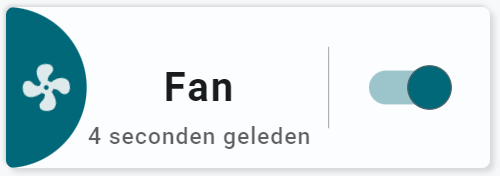

<!-- GT/GL -->
##:sak-sak-logo: Visualization

{width="300"}
{width="300"}
<br>{width="300"}
{width="300"}

This card uses the [Material 3 theme D06, TealBlue][ham3-d06-url]

| Description| Aspect Ratio| Target Size |
|-|-|-|
| A simple switch card with the "switch" on the left side of the card | 3/1 | Grid with 2 columns |

| SAK Tool| Used for |
|-|-|
| Circle | The half circle, as the left part of the circle is cutoff by the card. Circle is animated, state dependent|
| Icon | Entity Icon. Animated, state dependent. Icon spins in this case|
| Name | Name of Entity|
| State | Secondary Info of Entity|
| Line | Used as vertical separator |
| Switch | The switch. Animated, state dependent|

##:sak-sak-logo: Interaction

| Part | Description|
|-|-|
| Switch | Used to toggle the binary sensor entity |
| Other tools | All tools connected to an entity do show by default the "more-info" dialog once clicked |

##:sak-sak-logo: Usage (Not Yet Implemented)
If the below YAML example definition is encapsulated into a decluttering_template, its usage would be:

```yaml linenums="1"
- type: custom:decluttering-card
  template: sak_card_switch1
  variables:
    - entity: switch.fan
    - name: Fan
    - spin: true                    # Assumes there is a class for spin animation
```

In the future, SAK will support card templates, and usage would be (I hope) something like:


```yaml linenums="1"
- type: custom:swiss-army-knife-card
  template: sak_card_switch1
  entities:
    - entity: switch.fan
      name: Fan
    - entity: switch.fan
      secondary_info: last_changed
      format: relative
  variables:
    sak_icon_animation_spin: true
```

##:sak-sak-logo: YAML Example Definition

??? Info "Full definition of card"
    ```yaml linenums="1"
    - type: 'custom:swiss-army-knife-card'
      entities:
        - entity: switch.fan
          name: 'Fan'
        - entity: switch.fant
          secondary_info: last_changed
          format: relative
      # Define aspect ratio
      aspectratio: 3/1                          # Card is 300x100 grid

      layout:
        toolsets:
          # ================================================================
          - toolset: half-circle
            position:
              cx: 0                             # Center on cards border 
              cy: 50
            tools:
              # ------------------------------------------------------------
              - type: circle
                position:
                  cx: 50
                  cy: 50
                  radius: 50
                entity_index: 0
                animations:
                  - state: 'on'
                    styles:
                      circle:
                        fill: var(--theme-sys-color-primary)
                  - state: 'off'
                    styles:
                      circle:
                        fill: var(--theme-sys-elevation-surface-neutral4)
                styles:
                  circle:
                    stroke: none
                    # transition: fill 1s ease

          # ================================================================
          - toolset: column-icon
            position:
              cx: 25
              cy: 50
            tools:
              # ------------------------------------------------------------
              - type: icon
                position:
                  cx: 50
                  cy: 50
                  align: center
                  icon_size: 35
                icon: mdi:fan
                entity_index: 0
                animations:
                  - state: 'on'
                    styles:
                      icon:
                        animation: spin 3s linear infinite
                        fill: var(--primary-background-color)
                  - state: 'off'
                    styles:
                      icon:
                        fill: var(--theme-sys-color-secondary)
                styles:
                  icon:
                    fill: var(--primary-background-color)
                    opacity: 0.9
                    # transition: fill 1s ease
                
          # ================================================================
          - toolset: column-name
            position:
              cx: 120
              cy: 50
            tools:
              # ------------------------------------------------------------
              - type: name
                position:
                  cx: 50
                  cy: 50
                entity_index: 0
                styles:
                  name:
                    text-anchor: middle
                    font-size: 25em
                    font-weight: 700
                    opacity: 1
              # ------------------------------------------------------------
              - type: state
                position:
                  cx: 50
                  cy: 80
                entity_index: 1
                show:
                  uom: none
                styles:
                  state:
                    text-anchor: middle
                    font-size: 14em
                    font-weight: 500
                    opacity: 0.7

          # ================================================================
          - toolset: line1
            position:
              cx: 200                           # On 1/3 of card width
              cy: 50
            tools:
              # ------------------------------------------------------------
              - type: line
                position:
                  cx: 50
                  cy: 50
                  orientation: vertical
                  length: 50
                styles:
                  line:
                    fill: var(--primary-text-color)
                    opacity: 0.5

          # ================================================================
          - toolset: switch
            position:
              cx: 250                           # On 1/3 of card width
              cy: 50
              scale: 3
            tools:
              # ------------------------------------------------------------
              - type: switch
                position:
                  cx: 50
                  cy: 50
                entity_index: 0
                user_actions:
                  tap_action:
                    haptic: light
                    actions:
                      - action: call-service
                        service: switch.toggle

    ```

<!-- Image references -->

<!--- Internal References... --->
[Swiss Army Knife Tutorial 02]: ../tutorials/10-step-tutorial-02-intro.md

<!--- External References... --->
[ham3-d06-url]: https://material3-themes-manual.amoebelabs.com/examples/material3-example-theme-d06-tealblue/
