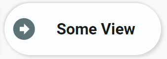

<!-- GT/GL -->

{width="200"}
<br>{width="200"}

This card uses the [Material 3 theme D06, TealBlue][ham3-d06-url]

!!! info "Its a card, but it just demonstrates how to use the `navigate` user action on a tool"

| Description| Aspect Ratio| Target Size |
|-|-|-|
| A card that shows an icon and text, and has a `navigate` user action.| 3/1 | Grid with 3 columns |

| SAK Tool| Used for |
|-|-|
| Icon | Configured Icon (variable) |
| Text | Navigation text (variable) |
| RectEx | A rectangle covering the whole card to act as a button to handle the navigation action|

##:sak-sak-logo: Interaction

| Part | Description|
|-|-|
| Card | This card navigates to the configured view|

##:sak-sak-logo: Usage
[:octicons-tag-24: 1.0.0-rc.3][github-releases]

```yaml linenums="1"
- type: 'custom:swiss-army-knife-card'
  layout:
    template:
      name: sak_layout_fce_navigate
      variables:
        - sak_layout_navigate_icon: 'mdi:arrow-right-bold-circle'
        - sak_layout_navigate_text: 'Some View'
        - sak_layout_navigate_path: 'tut-03-p1'
```

| Data | Default| Required | Description |
|-|-|-|-|
| sak_layout_navigate_icon | mdi:arrow-right-bold-circle | :material-close: | The used icon on the card |
| sak_layout_navigate_text | | :material-check: | The text displayd on the card |
| sak_layout_navigate_path | | :material-check: | The path name of the view you want to navigate to |

##:sak-sak-logo: YAML Template Definition
[:octicons-tag-24: 1.0.0-rc.3][github-releases]
??? Info "Full definition of layout template"
    ```yaml linenums="1"
    sak_layout_fce_navigate:
      template:
        type: layout
        defaults: 
          - sak_layout_navigate_icon: mdi:arrow-right-bold-circle
          - sak_layout_navigate_text: 'Navigate'
          - sak_layout_navigate_path: 'Unknown'
      layout:
        styles:
          card:
            border-radius: 25em
            background: var(--theme-sys-color-secondary-container)
        aspectratio: 3/1
        toolsets:
          # ================================================================
          - toolset: column-icon
            position:
              cx: 50
              cy: 50
            tools:
              # ------------------------------------------------------------
              - type: icon
                position:
                  cx: 50
                  cy: 50
                  align: center
                  icon_size: 50
                icon: '[[sak_layout_navigate_icon]]'
                styles:
                  icon:
                    fill: var(--secondary-text-color)
                    opacity: 0.9
                
          # ================================================================
          - toolset: button-text
            position:
              cx: 175
              cy: 50
            tools:
              # ------------------------------------------------------------
              - type: text
                position:
                  cx: 50
                  cy: 50
                text: '[[sak_layout_navigate_text]]'
                styles:
                  text:
                    text-anchor: middle
                    font-size: 30em
                    font-weight: 700
                    opacity: 1

          # ================================================================
          - toolset: button-cover
            position:
              cx: 150
              cy: 50
            tools:
              # ------------------------------------------------------------
              - type: rectex
                position:
                  cx: 50
                  cy: 50
                  height: 100
                  width: 300
                user_actions:
                  tap_action:
                    haptic: light
                    actions:
                      - action: navigate
                        navigation_path: '[[sak_layout_navigate_path]]'
                styles:
                  rectex:
                    fill: rgba(0,0,0,0)
    ```
<!-- Image references -->

<!--- Internal References... --->
[Swiss Army Knife Tutorial 02]: ../tutorials/10-step-tutorial-02-intro.md

<!--- External References... --->
[ham3-d06-url]: https://material3-themes-manual.amoebelabs.com/examples/material3-example-theme-d06-tealblue/
[github-releases]: https://github.com/amoebelabs/swiss-army-knife-card/releases/
