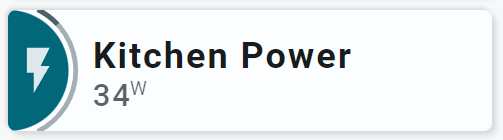

<!-- GT/GL -->
##:sak-sak-logo: Visualization

{width="300"}
{width="300"}
<br>{width="300"}
{width="300"}

This card uses the [Material 3 theme D06, TealBlue][ham3-d06-url]

| Description| Aspect Ratio| Target Size |
|-|-|-|
| A card that displays the on/off state of a power outlet, but also displays the power value. <br>Both using a segmented arc and as state.| 4/1 | Grid with 2 columns |

| SAK Tool| Used for |
|-|-|
| Circle | The half circle, as the left part of the circle is cutoff by the card. Animated, state dependent|
| Icon | Entity Icon. Animated, state dependent|
| SegArc | Minimalistic implementation of segmented arc showing the sensors state with a single color|
| Name | Name of Entity|
| State | Value of entity|

##:sak-sak-logo: Interaction

| Part | Description|
|-|-|
| Card | All tools connected to an entity do show by default the "more-info" dialog once clicked |

##:sak-sak-logo: Usage
[:octicons-tag-24: 1.0.0-rc.3][github-releases]

!!! warning "Replace example entities with your entities!"

```yaml linenums="1"
- type: 'custom:swiss-army-knife-card'
  entities:
    - entity: sensor.dsmr_reading_electricity_currently_delivered
      name: 'PwrOutl #3'
    - entity: switch.washingmachine_energy
      name: 'Kitchen Switch'
    - entity: sensor.washingmachine_energy_power  # Just for the demo!!!!
      name: 'Kitchen Switch #2'
  layout:
    template:
      name: sak_layout_fce_power_outlet3
      variables:
        - sak_layout_power_outlet_segarc_scale_max_watt: 200
```

| Data | Default| Required | Description |
|-|-|-|-|
| entities |  | :material-check: | The single entity on the card |
| sak_layout_power_outlet_segarc_scale_max_watt | 200 | :material-check: | The max value of the scale |


##:sak-sak-logo: YAML Template Definition
[:octicons-tag-24: 1.0.0-rc.3][github-releases]
??? Info "Full definition of layout template"
    ```yaml linenums="1"
    sak_layout_fce_power_outlet3:
      template:
        type: layout
        defaults: 
          - sak_layout_power_outlet_segarc_scale_max_watt: 200
      layout:
        aspectratio: 4/1
        toolsets:
          # ================================================================
          - toolset: half-circle
            position:
              cx: 0                             # Center on cards border 
              cy: 50
            tools:
              # ------------------------------------------------------------
              - type: circle
                position:
                  cx: 50
                  cy: 50
                  radius: 50
                entity_index: 1
                animations:
                  - state: 'on'
                    styles:
                      circle:
                        fill: var(--theme-sys-color-primary)
                  - state: 'off'
                    styles:
                      circle:
                        fill: var(--theme-sys-elevation-surface-neutral4)
                styles:
                  circle:
                    stroke: none
                    fill: var(--theme-sys-elevation-surface-neutral4)

              # ------------------------------------------------------------ 
              - type: 'segarc'
                id: 0
                position:
                  cx: 50
                  cy: 50
                  start_angle: 25
                  end_angle: 155
                  width: 4
                  radius: 58
                entity_index: 2
                scale:
                  min: 0
                  max: '[[sak_layout_power_outlet_segarc_scale_max_watt]]'
                  width: 6
                  offset: 12
                show:
                  scale: false
                  style: 'colorlist'
                segments:
                  colorlist:
                    gap: 1
                    colors:
                      - var(--theme-sys-color-secondary)
                styles:
                  foreground:
                    fill: darkgrey
                  background:
                    fill: var(--theme-sys-color-secondary)
                    opacity: 0.5

          # ================================================================
          - toolset: column-icon
            position:
              cx: 25
              cy: 50
            tools:
              # ------------------------------------------------------------
              - type: icon
                position:
                  cx: 50
                  cy: 50
                  align: center
                  icon_size: 45
                entity_index: 1
                animations:
                  - state: 'on'
                    styles:
                      icon:
                        fill: var(--primary-background-color)
                  - state: 'off'
                    styles:
                      icon:
                        fill: var(--theme-sys-color-secondary)
                styles:
                  icon:
                    fill: var(--theme-sys-color-secondary)
                    opacity: 0.9
                
          # ================================================================
          - toolset: column-name
            position:
              cx: 70                # Left part = 75, so 75+(300-75)/2
              cy: 50
            tools:
              # ------------------------------------------------------------
              - type: name
                position:
                  cx: 50
                  cy: 37
                entity_index: 0
                styles:
                  name:
                    text-anchor: start
                    font-size: 30em
                    font-weight: 700
                    opacity: 1
              # ------------------------------------------------------------
              - type: state
                position:
                  cx: 50
                  cy: 70
                entity_index: 2
                styles:
                  state:
                    text-anchor: start
                    font-size: 26em
                    font-weight: 500
                    opacity: 0.7
    ```

<!-- Image references -->

<!--- Internal References... --->
[Swiss Army Knife Tutorial 02]: ../tutorials/10-step-tutorial-02-intro.md

<!--- External References... --->
[ham3-d06-url]: https://material3-themes-manual.amoebelabs.com/examples/material3-example-theme-d06-tealblue/
[github-releases]: https://github.com/amoebelabs/swiss-army-knife-card/releases/
