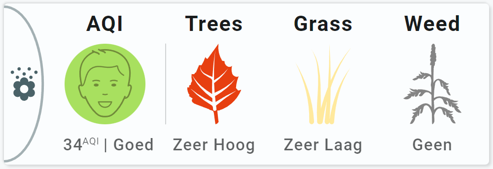

<!-- GT/GL -->
##:sak-sak-logo: Visualization

{width="600"}
<br>{width="600"}

This card uses the [Material 3 theme D06, TealBlue][ham3-d06-url]

| Description| Aspect Ratio| Target Size |
|-|-|-|
| A card that shows the pollen status from Tomorrow and the AQI value. This value from Tomorrow doesn't work, so I used the default AQI integration.| 6/2 | Grid with 1 column |

| SAK Tool| Used for |
|-|-|
| Ellipse | The half ellipse, as the left part of the circle is cutoff by the card.|
| Icon | Entity Icon. |
| Name | Name of AQI Entity |
| Circle | Circle as background for the Svg. Animated, state dependent |
| UserSvg | Svg image for AQI. Animated, state dependent |
| State | State of AQI |
| State | State of Pollutant |
| Line | Vertical line separator |
| Name | Name of Trees Entity |
| UserSvg | Svg image for trees. Animated, state dependent |
| State | State of trees entity|
| Name | Name of Grass Entity |
| UserSvg | Svg image for grass. Animated, state dependent |
| State | State of grass entity|
| Name | Name of Weed Entity |
| UserSvg | Svg image for weed. Animated, state dependent |
| State | State of weed entity|

##:sak-sak-logo: Integrations
You need the [AirVisual integration](https://www.home-assistant.io/integrations/airvisual/):
[](https://my.home-assistant.io/redirect/config_flow_start?domain=airvisual)
<br>and the [tomorrow.io integration](https://www.home-assistant.io/integrations/tomorrowio/):
[](https://my.home-assistant.io/redirect/config_flow_start?domain=tomorrowio)

##:sak-sak-logo: Interaction

| Part | Description|
|-|-|
| Card | All tools connected to an entity do show by default the "more-info" dialog once clicked |

##:sak-sak-logo: Usage
[:octicons-tag-24: 1.0.0-rc.3][github-releases]

!!! info "You need the tomorrow.io SVG files from Github and put those in the `www/images/tomorrow` folder"
    Images and colors used for this card are adapted versions from Isabella Alströms pollen images

!!! info "You need the AirVisual SVG files from Github and put those in the `www/images/airvisual` folder"

!!! warning "Replace tomorrow entities with your entities!. The AQI entities are generic"
  
```yaml linenums="1"
- type: 'custom:swiss-army-knife-card'
  entities:
    - entity: sensor.tomorrow_io_tree_pollen_index
      name: 'Trees'
    - entity: sensor.tomorrow_io_grass_pollen_index
      name: 'Grass'
    - entity: sensor.tomorrow_io_weed_pollen_index
      name: 'Weed'
    - entity: sensor.u_s_air_quality_index
      name: 'AQI'
    - entity: sensor.u_s_air_pollution_level
  layout:
    template:
      name: sak_layout_fce_tomorrow_pollen_all_aqi
      variables:
        - sak_layout_tomorrow_pollen_image_path: tomorrow/
```

| Data | Default| Required | Description |
|-|-|-|-|
| entities |  | :material-check: | The three tomorrow pollen entities; tree, grass and weed and the two AQI entities, **in that order!** |
| sak_layout_tomorrow_pollen_image_path | tomorrow/ | :material-close: | Folder in /local/images/, including a trailing slash! |

##:sak-sak-logo: YAML Template Definition
[:octicons-tag-24: 1.0.0-rc.3][github-releases]
??? Info "Full definition of layout template"
    ```yaml
    sak_layout_fce_tomorrow_pollen_all_aqi:
      template:
        type: layout
        defaults: 
          - sak_layout_tomorrow_pollen_image_path: 'tomorrow/'
      layout:
        aspectratio: 6/2
        toolsets:
          # ================================================================
          - toolset: line1
            position:
              cx: 200
              cy: 100
            tools:
              # ------------------------------------------------------------
              - type: line
                position:
                  cx: 50
                  cy: 50
                  orientation: vertical
                  length: 100
                styles:
                  line:
                    fill: var(--primary-text-color)
                    opacity: 0.5

          # ================================================================
          - toolset: half-circle
            position:
              cx: 0                             # Center on cards border 
              cy: 100
            tools:
              # ------------------------------------------------------------
              - type: ellipse
                position:
                  cx: 50
                  cy: 50
                  radiusx: 48
                  radiusy: 96
                styles:
                  ellipse:
                    fill: none
                    stroke: var(--theme-sys-color-secondary)
                    stroke-width: 3em
                    opacity: 0.5

            # ================================================================
          - toolset: column-icon
            position:
              cx: 25
              cy: 100
            tools:
              # ------------------------------------------------------------
              - type: icon
                position:
                  cx: 50
                  cy: 50
                  align: center
                  icon_size: 50
                entity_index: 0
                styles:
                  icon:
                    fill: var(--theme-sys-color-secondary)

          # ================================================================
          - toolset: aqi-column
            position:
              cx: 125
              cy: 100
            tools:
              # ------------------------------------------------------------
              - type: name
                position:
                  cx: 50
                  cy: -25
                entity_index: 3
                styles:
                  name:
                    text-anchor: middle
                    font-size: 26em
                    font-weight: 700
                    opacity: 1
              # ------------------------------------------------------------
              - type: circle
                position:
                  cx: 50
                  cy: 50
                  radius: 50
                entity_index: 3
                show:
                  style: 'colorstops'
                colorstops:
                  template:
                    name: colorstops_airvisual
                    variables:
                      - thegap: 2
                styles:
                  circle:
                    stroke: none
                    fill: var(--theme-sys-elevation-surface-neutral4)
              # ------------------------------------------------------------
              - type: 'usersvg'
                entity_index: 3
                position:
                  cx: 50
                  cy: 50
                  height: 95
                  width: 95
                style: 'images'
                images:
                  - face1: /local/images/airvisual/ic-face-1.svg
                  - face2: /local/images/airvisual/ic-face-2.svg
                  - face3: /local/images/airvisual/ic-face-3.svg
                  - face4: /local/images/airvisual/ic-face-4.svg
                  - face5: /local/images/airvisual/ic-face-5.svg
                  - face6: /local/images/airvisual/ic-face-6.svg
                animations:
                  - state: '50'
                    operator: <=
                    image: face1
                  - state: '100'
                    operator: <=
                    image: face2
                  - state: '150'
                    operator: <=
                    image: face3
                  - state: '200'
                    operator: <=
                    image: face4
                  - state: '300'
                    operator: <=
                    image: face5
                  - state: '9999'
                    operator: <=
                    image: face6
                styles:
                  usersvg:
                    stroke-width: 5em
              # ------------------------------------------------------------
              - type: state
                position:
                  cx: 43
                  cy: 125
                entity_index: 3
                show:
                  ellipsis: 5
                styles:
                  state:
                    text-anchor: end
                    font-size: 20em
                    font-weight: 500
                    opacity: 0.7

              # ------------------------------------------------------------
              - type: state
                position:
                  cx: 48
                  cy: 125
                entity_index: 4
                text:
                  before: ' | '
                styles:
                  state:
                    text-anchor: start
                    font-size: 20em
                    font-weight: 500
                    opacity: 0.7

          # ================================================================
          - toolset: pollen-column-trees
            position:
              cx: 260
              cy: 100
            tools:
              # ------------------------------------------------------------
              - type: name
                position:
                  cx: 50
                  cy: -25
                entity_index: 0
                styles:
                  name:
                    text-anchor: middle
                    font-size: 26em
                    font-weight: 700
                    opacity: 1
              # ------------------------------------------------------------
              - type: 'usersvg'
                entity_index: 0
                position:
                  cx: 50
                  cy: 50
                  height: 100
                  width: 100
                style: 'images'
                variables:
                  path: '[[sak_layout_tomorrow_pollen_image_path]]'
                  prefix: 'pollen_tree_'
                images:
                  - default: >
                      [[[
                        return "/local/images/"+ config.variables.path + config.variables.prefix + state + ".svg";
                      ]]]
              # ------------------------------------------------------------
              - type: state
                position:
                  cx: 50
                  cy: 125
                entity_index: 0
                show:
                  uom: none
                styles:
                  state:
                    text-anchor: middle
                    font-size: 20em
                    font-weight: 500
                    opacity: 0.7
          # ================================================================
          - toolset: pollen-column-grass
            position:
              cx: 395
              cy: 100
            tools:
              # ------------------------------------------------------------
              - type: name
                position:
                  cx: 50
                  cy: -25
                entity_index: 1
                styles:
                  name:
                    text-anchor: middle
                    font-size: 26em
                    font-weight: 700
                    opacity: 1
              # ------------------------------------------------------------
              - type: 'usersvg'
                entity_index: 1
                position:
                  cx: 50
                  cy: 50
                  height: 100
                  width: 100
                style: 'images'
                variables:
                  path: '[[sak_layout_tomorrow_pollen_image_path]]'
                  prefix: 'pollen_grass_'
                images:
                  - default: >
                      [[[
                        return "/local/images/"+ config.variables.path + config.variables.prefix + state + ".svg";
                      ]]]
              # ------------------------------------------------------------
              - type: state
                position:
                  cx: 50
                  cy: 125
                entity_index: 1
                show:
                  uom: none
                styles:
                  state:
                    text-anchor: middle
                    font-size: 20em
                    font-weight: 500
                    opacity: 0.7

          # ================================================================
          - toolset: pollen-column-weed
            position:
              cx: 530
              cy: 100
            tools:
              # ------------------------------------------------------------
              - type: name
                position:
                  cx: 50
                  cy: -25
                entity_index: 2
                styles:
                  name:
                    text-anchor: middle
                    font-size: 26em
                    font-weight: 700
                    opacity: 1
              # ------------------------------------------------------------
              - type: 'usersvg'
                entity_index: 2
                position:
                  cx: 50
                  cy: 50
                  height: 100
                  width: 100
                style: 'images'
                variables:
                  path: '[[sak_layout_tomorrow_pollen_image_path]]'
                  prefix: 'pollen_weed_'
                images:
                  - default: >
                      [[[
                        return "/local/images/"+ config.variables.path + config.variables.prefix + state + ".svg";
                      ]]]
              # ------------------------------------------------------------
              - type: state
                position:
                  cx: 50
                  cy: 125
                entity_index: 2
                show:
                  uom: none
                styles:
                  state:
                    text-anchor: middle
                    font-size: 20em
                    font-weight: 500
                    opacity: 0.7
    ```

<!-- Image references -->

<!--- Internal References... --->
[Swiss Army Knife Tutorial 02]: ../tutorials/10-step-tutorial-02-intro.md
[Swiss Army Knife Javascript Snippets]: ../basics/templates/javascript-snippets.md

<!--- External References... --->
[ham3-d06-url]: https://material3-themes-manual.amoebelabs.com/examples/material3-example-theme-d06-tealblue/
[github-releases]: https://github.com/amoebelabs/swiss-army-knife-card/releases/
