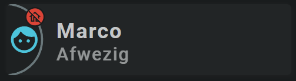

<!-- GT/GL -->
##:sak-sak-logo: Visualization

{width="300"}
{width="300"}
<br>{width="600"}
<br>{width="300"}
{width="300"}

This card uses the [Material 3 theme D06, TealBlue][ham3-d06-url]

!!! info "This card shows you some possibilities to apply JavaScript to the animations section"
    The card seems like a standard, simple card, but isn't due to some Home Assistant functionalities and the possibilities of using either an icon or an entity picture for the person.

    The [use of JavaScript][Swiss Army Knife Javascript Snippets] to fetch the zone's Icon, to do some state dependent color changes and taking care of the "use entity_picture yes/no" setting are nice examples of the possibilities that JavaScript adds to tools. It are just a few lines, but very powerful!
    
    It also takes care of fetching the icon of additional zones (ie not the home zone).
    
| Description| Aspect Ratio| Target Size |
|-|-|-|
| A card that shows in which zone a person is, or if in no known zone as away / not home.| 4/1 | Grid with 2 columns |

| SAK Tool| Used for |
|-|-|
| Icon | Background Icon (only in first screenshot) :smile: |
| Circle | The half circle, as the left part of the circle is cutoff by the card |
| Icon | Entity Icon. Animated, state dependent and only visible if no entity_picture should be displayed |
| UserSvg | Shows the Entity Picture. Only visible if entity_picture should be displayed |
| Icon | Zone Icon, ie where is the person according to the zone configuration. Animated, state dependent|
| Name | Name of Entity|
| State | State of entity|

##:sak-sak-logo: Interaction

| Part | Description|
|-|-|
| Card | All tools connected to an entity do show by default the "more-info" dialog once clicked |

##:sak-sak-logo: Usage
[:octicons-tag-24: 1.0.0-rc.3][github-releases]

Using the default mode: an icon for the person entity:
```yaml linenums="1"
- type: 'custom:swiss-army-knife-card'
  entities:
    - entity: person.marco
      name: 'Person'
      icon: mdi:face-man
  layout:
    template:
      name: sak_layout_fce_person
      variables:
        - sak_layout_fce_person_zone_entities:
            - zone.the_gym
            - zone.marco_work
            - zone.marco_parents
            - zone.zoo
```
Using an `entity_picture` for the person entity. Picture can be defined here, or (default) the `entity_picture` defined for the person is used:
```yaml linenums="1"
- type: 'custom:swiss-army-knife-card'
  entities:
    - entity: person.tha_washer
      name: 'Tha Washer'
      icon: mdi:face-man
      entity_picture: "/local/images/tha-washer.jpg"
  layout:
    template:
      name: sak_layout_fce_person
      variables:
        - sak_layout_fce_person_use_entity_picture: true
        - sak_layout_fce_person_zone_entities:
            - zone.the_gym
            - zone.marco_work
            - zone.marco_parents
            - zone.zoo
```

| Data | Default| Required | Description |
|-|-|-|-|
| entities |  | :material-check: | The person entity |
| sak_layout_fce_person_zone_entities | | :material-check: | The list of zone entities for this person to be displayed. There is no limit, it is really a list which is used when the person is not at home! |
| sak_layout_fce_person_use_entity_picture | false | :material-close: | If set to true, an entity picture is displayed instead of the persons icon. Default the picture configured for the person is used, but can be overridden by specifying an entity_picture in the entity configuration in the view |

##:sak-sak-logo: YAML Template Definition
[:octicons-tag-24: 1.0.0-rc.3][github-releases]
??? Info "Full definition of layout template"
    ```yaml linenums="1"
    sak_layout_fce_person:
      template:
        type: layout
        defaults: 
          - sak_layout_fce_person_use_entity_picture: false
      layout:
        aspectratio: 4/1
        toolsets:
          # ================================================================
            # Extra background icon. Just for fun and filling some space
          - toolset: background-icon
            position:
              cx: 350
              cy: 50
            tools:
              # ------------------------------------------------------------
              - type: icon
                position:
                  cx: 50
                  cy: 50
                  align: center
                  icon_size: 100
                icon: mdi:map-marker-radius-outline
                styles:
                  icon:
                    fill: var(--theme-sys-elevation-surface-neutral2)

          # ================================================================
          - toolset: half-circle
            position:
              cx: 0                             # Center on cards border 
              cy: 50
            tools:
              # ------------------------------------------------------------
              - type: circle
                position:
                  cx: 50
                  cy: 50
                  radius: 50
                styles:
                  circle:
                    stroke: var(--theme-sys-color-secondary)
                    stroke-width: 3em
                    opacity: 0.5

          # ================================================================
          - toolset: column-icon
            position:
              cx: 25
              cy: 50
            tools:
              # ------------------------------------------------------------
              - type: icon
                position:
                  cx: 50
                  cy: 50
                  align: center
                  icon_size: 45
                entity_index: 0
                variables:
                  sak_layout_fce_person_use_entity_picture: '[[sak_layout_fce_person_use_entity_picture]]'
                animations:
                    # Return current state, so always a match!
                  - state: '[[[ return state; ]]]'
                    styles:
                      icon:
                        # Set fill depending on being at home!
                        fill: >
                          [[[ if (['home', 'not_home'].includes(state)) return 'var(--theme-sys-color-primary)';
                              return 'var(--theme-sys-color-tertiary)';
                          ]]]
                        # Hide icon if using entity_picture!
                        display: >
                          [[[ if (tool_config.variables.sak_layout_fce_person_use_entity_picture) return 'none';
                              return 'initial';
                          ]]]
                styles:
                  icon:
                    fill: var(--theme-sys-color-secondary)
                    opacity: 0.9

              # ------------------------------------------------------------
              - type: usersvg
                position:
                  cx: 50
                  cy: 50
                  height: 45
                  width: 45
                entity_index: 0
                variables:
                  sak_layout_fce_person_use_entity_picture: '[[sak_layout_fce_person_use_entity_picture]]'
                clip_path:
                  position:
                    cx: 50
                    cy: 50
                    height: 40            # Slightly crop image (from 45->40)
                    width: 40
                    radius:
                      all: 20             # Radius 20 results in full circle
                style: 'images'
                images:                   # Fetch entity_picture from config or entity itself
                  - default: >
                      [[[
                        if (tool_config.variables.sak_layout_fce_person_use_entity_picture) {
                          return (entity_config?.entity_picture ||
                                 entity.attributes?.entity_picture || 'none');
                        } else {
                          return 'none';
                        }
                      ]]]
                animations:
                    # Return current state, so always a match!
                  - state: '[[[ return state; ]]]'
                    image: default
                    styles:
                      icon:
                        # Hide usersvg tool if using icon!
                        display: >
                          [[[ if (!tool_config.variables.sak_layout_fce_person_use_entity_picture) return 'none';
                              return 'initial';
                          ]]]
                
          # ================================================================
          - toolset: zone-icon
            position:
              cx: 40
              cy: 18
            tools:
              # ------------------------------------------------------------
              - type: circle
                position:
                  cx: 50
                  cy: 50
                  radius: 14
                entity_index: 0
                animations:
                    # Return current state, so always a match!
                  - state: '[[[ return state; ]]]'
                    styles:
                      circle:
                        # Set fill depending on being at home or some unwanted state!
                        fill: >
                          [[[ if (state == 'home') return 'var(--theme-sys-color-primary)';
                              if (state == 'not_home') return 'var(--brand-google-red)';
                              if (['unavailable', 'unknown'].includes(state)) return 'black';
                              return 'var(--theme-sys-color-tertiary)';
                          ]]]
                styles:
                  circle:
                    fill: var(--brand-google-red)
                    stroke: var(--primary-background-color)
                    stroke-width: 2em

              # ------------------------------------------------------------
              - type: icon
                position:
                  cx: 50
                  cy: 50
                  align: center
                  icon_size: 18
                entity_index: 0
                variables:
                  zone_ids: '[[sak_layout_fce_person_zone_entities]]'
                animations:
                    # Return current state, so always a match!
                  - state: '[[[ return state; ]]]'
                    # Fetch icon of zone. If no match on zone, the state 'not_home' is given.
                    # Check that state, and return the 'not home' icon in that case!
                    icon: >
                      [[[ if (state == 'not_home') return 'mdi:home-off-outline';
                          if (state == 'home') return states['zone.home'].attributes.icon;
                          // For not home, we get the friendly name as input. Must find that one to retrieve
                          // the zone's id...
                          
                          for (var i=0; i<tool_config.variables.zone_ids.length; i++) {
                            var zone = states[tool_config.variables.zone_ids[i]];
                            if (zone && zone.attributes.friendly_name == state) {
                              return states[zone.entity_id].attributes.icon;
                            }
                          }
                          return 'mdi:map-marker-question';
                      ]]]
                    styles:
                      icon:
                        fill: var(--primary-background-color)
                styles:
                  icon:
                    fill: var(--primary-background-color)

          # ================================================================
          - toolset: column-name
            position:
              cx: 70
              cy: 50
            tools:
              # ------------------------------------------------------------
              - type: name
                position:
                  cx: 50
                  cy: 37
                entity_index: 0
                styles:
                  name:
                    text-anchor: start
                    font-size: 30em
                    font-weight: 700
                    opacity: 1
              # ------------------------------------------------------------
              - type: state
                position:
                  cx: 50
                  cy: 70
                entity_index: 0
                show:
                  uom: none
                styles:
                  state:
                    text-anchor: start
                    font-size: 26em
                    font-weight: 500
                    opacity: 0.7
    ```

<!-- Image references -->

<!--- Internal References... --->
[Swiss Army Knife Tutorial 02]: ../../tutorials/10-step-tutorial-02-intro.md
[Swiss Army Knife Javascript Snippets]: ../../basics/templates/javascript-snippets.md

<!--- External References... --->
[ham3-d06-url]: https://material3-themes-manual.amoebelabs.com/examples/material3-example-theme-d06-tealblue/
[github-releases]: https://github.com/amoebelabs/swiss-army-knife-card/releases/
